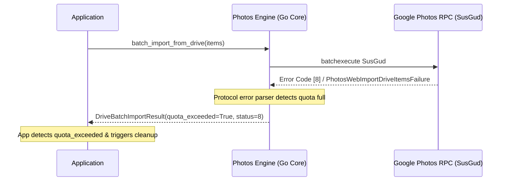

# Python API Reference

Comprehensive reference for classes, methods, models, and top-level functions in the `photos_engine` package.

---

## Top-Level Functions

All common operations can be executed directly from the module namespace without manually creating a client instance.

### `get_token()`

```python
photos_engine.get_token(auth_data: Optional[str] = None) -> str
```

Retrieves an active OAuth2 Bearer token (`ya29...`) with transparent auto-refreshing.

**Parameters:**

| Parameter | Type | Default | Description |
| :--- | :--- | :--- | :--- |
| `auth_data` | `str, optional` | `None` | Master token credential string. If omitted, reads from `.env` or `AUTH_DATA` environment variable. |

**Returns:**

* `str`: A valid OAuth2 Bearer token string.

**Example:**

```python
import photos_engine

token = photos_engine.get_token()
print("Token:", token[:25] + "...")
```

---

### `create_share_link()`

```python
photos_engine.create_share_link(
    media_keys: Union[str, List[str]], 
    auth_data: Optional[str] = None
) -> PublicShareLink
```

Generates an official public short link (`https://photos.app.goo.gl/...`) for one or multiple media keys.

**Parameters:**

| Parameter | Type | Default | Description |
| :--- | :--- | :--- | :--- |
| `media_keys` | `str` or `List[str]` | *required* | A single media key or a list of media keys to share. |
| `auth_data` | `str, optional` | `None` | Custom credentials string. |

**Returns:**

* [`PublicShareLink`](#publicsharelink): Object containing `share_url`, `media_key`, and `auth_key`.

**Example:**

```python
link = photos_engine.create_share_link(["AF1QipM...", "AF1QipN..."])
print("Public Share Link:", link.share_url)
```

---

### `get_download_url()`

```python
photos_engine.get_download_url(
    media_key: str, 
    auth_data: Optional[str] = None
) -> DownloadInfo
```

Extracts original-quality media stream download URLs, file metadata, exact byte sizes, and SHA-1 checksums.

**Parameters:**

| Parameter | Type | Default | Description |
| :--- | :--- | :--- | :--- |
| `media_key` | `str` | *required* | The media item's unique key. |
| `auth_data` | `str, optional` | `None` | Custom credentials string. |

**Returns:**

* [`DownloadInfo`](#downloadinfo): Direct download stream link and file attributes.

---

### `import_share_url()`

```python
photos_engine.import_share_url(
    share_url: str, 
    auth_data: Optional[str] = None
) -> Dict[str, Any]
```

Scrapes a public Google Photos shared link (via native Go core engine) and saves all contained media items into your library with Google Pixel XL original quality backup spoofing.

**Parameters:**

| Parameter | Type | Default | Description |
| :--- | :--- | :--- | :--- |
| `share_url` | `str` | *required* | Public Google Photos URL (`https://photos.app.goo.gl/...`). |
| `auth_data` | `str, optional` | `None` | Custom credentials string. |

**Returns:**

* `dict`: Dictionary with `share_info` (`ShareInfo`), `shared_media` (`List[ScrapedShare]`), and `import_result` (`SaveResult`).

---

### `delete_by_media_key()`

```python
photos_engine.delete_by_media_key(
    media_key: str, 
    auth_data: Optional[str] = None
) -> bool
```

Permanently expunges an item from Google Photos using the atomic Move-to-Trash -> DeletePermanently sequence.

**Parameters:**

| Parameter | Type | Default | Description |
| :--- | :--- | :--- | :--- |
| `media_key` | `str` | *required* | Media key of the item to delete. |
| `auth_data` | `str, optional` | `None` | Custom credentials string. |

**Returns:**

* `bool`: `True` if successfully expunged, `False` otherwise.

---

### `is_file_in_library()`

```python
photos_engine.is_file_in_library(
    file_path: Union[str, Path], 
    auth_data: Optional[str] = None
) -> ExistResult
```

Computes the 20-byte SHA-1 hash of a local file and queries Google Photos to verify whether it already exists in your library.

**Parameters:**

| Parameter | Type | Default | Description |
| :--- | :--- | :--- | :--- |
| `file_path` | `str` or `Path` | *required* | Path to the local photo or video file. |
| `auth_data` | `str, optional` | `None` | Custom credentials string. |

**Returns:**

* [`ExistResult`](#existresult): Object indicating `.exists`, `.sha1_hash`, `.media_key`, and `.dedup_key`.

---

## Client Class

For stateful interactions or custom configuration, instantiate `photos_engine.Client`.

```python
from photos_engine import Client

client = Client(auth_data="...")
```

### Constructor

```python
Client(auth_data: Optional[str] = None, lib_path: Optional[str] = None)
```

| Parameter | Type | Default | Description |
| :--- | :--- | :--- | :--- |
| `auth_data` | `str, optional` | `None` | Master token string. If omitted, reads from `.env`. |
| `lib_path` | `str, optional` | `None` | Explicit path to compiled native dynamic library (`.dll`, `.so`, `.dylib`). |

### Client Methods

| Method | Return Type | Description |
| :--- | :--- | :--- |
| `client.get_token()` | `str` | Fetch active OAuth2 Bearer token. |
| `client.create_share_link(media_keys)` | `PublicShareLink` | Create public short link for media keys. |
| `client.get_download_url(media_key)` | `DownloadInfo` | Get direct stream download URL and metadata. |
| `client.import_share_url(share_url)` | `dict` | Scrape and save shared link with Pixel XL spoofing. |
| `client.import_shared_media(...)` | `SaveResult` | Low-level import of media keys with auth key. |
| `client.delete_by_media_key(media_key)`| `bool` | Permanently delete media item. |
| `client.move_to_trash(dedup_key)` | `bool` | Move item to trash via base64 dedup key. |
| `client.delete_permanently(dedup_key)`| `bool` | Permanently delete item from trash. |
| `client.find_media_by_hash(sha1_hash)` | `ExistResult` | Check if 20-byte SHA-1 hash exists in library. |
| `client.is_file_in_library(file_path)` | `ExistResult` | Check local file existence by hash. |

---

## Data Models

All models are strongly-typed Python dataclasses.

### `DownloadInfo`

```python
@dataclass
class DownloadInfo:
    download_url: str   # Direct original quality stream URL
    filename: str       # Original filename (e.g. VID_2026.mp4)
    file_size: int      # Exact file size in bytes
    sha1_hash: str      # Hex-encoded SHA-1 checksum
    dedup_key: str      # URL-safe base64 deduplication key
```

### `PublicShareLink`

```python
@dataclass
class PublicShareLink:
    share_url: str   # Public short URL (https://photos.app.goo.gl/...)
    media_key: str   # Envelope media key
    auth_key: str    # Internal authentication key for the envelope
```

### `SaveResult`

```python
@dataclass
class SaveResult:
    status: int           # Status code (2 = Success)
    success: bool         # True if successfully saved
    new_keys: List[str]   # Newly assigned media keys in user's library
```

### `ExistResult`

```python
@dataclass
class ExistResult:
    exists: bool      # True if present in library
    sha1_hash: str    # Hex SHA-1 hash
    media_key: str    # Media key if exists, empty otherwise
    dedup_key: str    # Dedup key if exists, empty otherwise
```

### `CookieStatus`

```python
@dataclass
class CookieStatus:
    valid: bool                 # True if cookies are active
    session_id: str = "default" # Session identifier
    account: Optional[str]      # Connected Google email address
    message: str                # Human-readable status message
```

### `DriveImportResult`

```python
@dataclass
class DriveImportResult:
    drive_file_id: str          # Original Google Drive file ID
    media_key: str              # Newly created Google Photos media key
    dedup_key: str              # Deduplication key in Photos
    download_url: Optional[str] # Direct stream download URL
    filename: str = ""          # Original filename (if available)
```

### `DriveBatchItem`

```python
@dataclass
class DriveBatchItem:
    drive_file_id: str          # Google Drive unique file ID
    mime_type: str = "video/*"  # MIME type of the file
```

### `DriveImportItemResult`

```python
@dataclass
class DriveImportItemResult:
    drive_file_id: str          # Google Drive file ID
    media_key: str              # Created Google Photos media key
    dedup_key: str              # Deduplication key in Photos
    download_url: Optional[str] # Direct download URL (if available)
    width: int = 0              # Media width in pixels
    height: int = 0             # Media height in pixels
    file_size: int = 0          # Exact file size in bytes
    status: int = 0             # Status code (0 = Success, 8 = Storage Quota Exceeded)
    error: str = ""             # Error description if failed
```

### `StorageQuota`

```python
@dataclass
class StorageQuota:
    usage_text: str    # Human-readable string, e.g. "9.3 GB of 15 GB used"
    used_display: str  # Display string of used space, e.g. "9.3 GB"
    total_display: str # Display string of total space, e.g. "15 GB"
    used_percent: float# Used percentage, e.g. 61.7
    free_percent: float# Free percentage, e.g. 38.3
    used_bytes: int    # Used storage in bytes
    total_bytes: int   # Total storage limit in bytes
```

### `DriveBatchImportResult`

```python
@dataclass
class DriveBatchImportResult:
    success_count: int               # Count of successfully imported items
    failed_count: int                # Count of failed items
    items: List[DriveImportItemResult] # Individual item results
    quota_exceeded: bool             # True if rejected due to storage quota full
    error_message: str               # Detailed error description
```

### `AccountResetResult`

```python
@dataclass
class AccountResetResult:
    success: bool        # True if reset succeeded
    total_deleted: int   # Total items moved to trash and purged
    trash_emptied: bool  # True if trash was permanently emptied
    message: str         # Detailed summary message
```

---

## Web Client & Cookies API

The Web Client API provides cookie-authenticated Google Photos session management, Google Drive-to-Photos imports, storage quota queries, download stream URL resolution, public link creation, and library cleanup.

!!! note "Engine Architecture"
    `photos_engine` is a standalone, low-level native engine powered directly by the compiled Go core dynamic library (`libphotos_engine`). The `NativeWebClient` (aliased as `WebClient`) communicates directly with Google Photos internal web RPC endpoints (`SusGud`, `VrseUb`, `SFKp8c`, `XwAOJf`, `e2FP6c`) via in-process C-ABI bindings without requiring any external web applications, servers, or proxy layers.

### `NativeWebClient` Overview

```python
from photos_engine import NativeWebClient, WebClient
```

Both `NativeWebClient` and `WebClient` reference the same class.

### WebClient Methods

| Method | Return Type | Description |
| :--- | :--- | :--- |
| `NativeWebClient.check_status(cookies)` | [`CookieStatus`](#cookiestatus) | Stateless cookie validation and account verification. |
| `NativeWebClient.from_blob(blob)` | `NativeWebClient` | Restore client from a serialized session blob. |
| [`client.import_from_drive()`](#import_from_drive) | [`DriveImportResult`](#driveimportresult) | Import single Drive file via `SusGud` RPC (with auto quota error). |
| [`client.batch_import_from_drive()`](#batch_import_from_drive) | [`DriveBatchImportResult`](#drivebatchimportresult) | Batch import Drive files with automatic quota full detection. |
| [`client.get_storage_quota()`](#get_storage_quota) | [`StorageQuota`](#storagequota) | Fetch storage usage, used/free percentages, and byte limits. |
| [`client.get_download_url()`](#get_download_url-web) | [`DownloadInfo`](#downloadinfo) | Direct download stream URL and dedup key via `VrseUb` RPC. |
| [`client.create_share_link()`](#create_share_link-web) | [`PublicShareLink`](#publicsharelink) | Create public `photos.app.goo.gl` short link via `SFKp8c` RPC. |
| [`client.reset_account()`](#reset_account) | [`AccountResetResult`](#accountresetresult) | Wipe entire library: move all items to trash and empty trash bin. |
| [`client.export_session_blob()`](#export_session_blob) | `bytes` | Export binary session state for database persistence. |
| [`client.export_cookies()`](#export_cookies) | `Dict[str, str]` | Export current live cookies from session jar. |
| [`client.close()`](#close) | `None` | Free the underlying Go client handle and allocated memory. |

---

### Constructor

```python
NativeWebClient(cookies: str, dll_path: Optional[str] = None)
```

**Parameters:**

| Parameter | Type | Default | Description |
| :--- | :--- | :--- | :--- |
| `cookies` | `str` | *required* | Raw cookie string (Netscape format, HTTP header string, or key-value pairs). |
| `dll_path` | `str, optional` | `None` | Custom path to the compiled Go shared library (`.dll`, `.so`, `.dylib`). |

**Example:**

```python
from photos_engine import NativeWebClient

# Use as a context manager for automatic handle release
with NativeWebClient(cookies="SID=...; HSID=...; SSID=...") as client:
    quota = client.get_storage_quota()
    print(f"Storage: {quota.usage_text}")
```

---

### `check_status()`

```python
NativeWebClient.check_status(cookies: str, dll_path: Optional[str] = None) -> CookieStatus
```

Class method to perform a stateless cookie validation and extract connected account email without retaining a persistent Go client handle.

**Parameters:**

| Parameter | Type | Default | Description |
| :--- | :--- | :--- | :--- |
| `cookies` | `str` | *required* | Cookie string to validate. |
| `dll_path` | `str, optional` | `None` | Custom path to Go shared library. |

**Returns:**

* [`CookieStatus`](#cookiestatus): Object containing `.valid` (`bool`), `.account` (`str` email), and `.message` (`str`).

**Example:**

```python
status = NativeWebClient.check_status("SID=...; HSID=...")
if status.valid:
    print(f"Connected: {status.account}")
else:
    print(f"Invalid cookies: {status.message}")
```

---

### `from_blob()`

```python
NativeWebClient.from_blob(blob: Union[bytes, str], dll_path: Optional[str] = None) -> NativeWebClient
```

Restores an active `NativeWebClient` instance from a previously serialized session blob (`bytes` or hex string).

**Parameters:**

| Parameter | Type | Default | Description |
| :--- | :--- | :--- | :--- |
| `blob` | `bytes` or `str` | *required* | Serialized session blob bytes or hex string from `export_session_blob()`. |
| `dll_path` | `str, optional` | `None` | Custom path to Go shared library. |

**Returns:**

* `NativeWebClient`: Active client restored with full session state (cookies, TLS session tickets).

---

### `import_from_drive()`

```python
client.import_from_drive(
    drive_file_id: str, 
    mime_type: str = "video/*", 
    cleanup: bool = False
) -> DriveImportResult
```

Imports a single file from Google Drive into Google Photos using the internal `SusGud` batchexecute RPC.

**Parameters:**

| Parameter | Type | Default | Description |
| :--- | :--- | :--- | :--- |
| `drive_file_id` | `str` | *required* | Google Drive unique file identifier. |
| `mime_type` | `str` | `"video/*"` | MIME type of the file. Defaults to `"video/*"`. |
| `cleanup` | `bool` | `False` | If `True`, automatically moves the item to trash and purges it after import. |

**Returns:**

* [`DriveImportResult`](#driveimportresult): Struct containing `drive_file_id`, `media_key`, `dedup_key`, and `download_url`.

**Quota Handling & Error Behavior:**

!!! warning "Automatic Quota Detection in Single Import"
    When Google Photos account storage is full, the native Go core detects `PhotosWebImportDriveItemsFailure` (error code `8`) in the RPC envelope and raises a `RuntimeError`:
    ```
    RuntimeError: GPWC_ImportFromDrive failed: STORAGE_QUOTA_EXCEEDED: Google Photos storage is full (PhotosWebImportDriveItemsFailure)
    ```
    Callers can catch `RuntimeError` and check `if "STORAGE_QUOTA_EXCEEDED" in str(err):` to detect quota exhaustion.

**Example:**

```python
try:
    result = client.import_from_drive("1A2B3C4D5E6F_drive_id")
    print(f"Imported Media Key: {result.media_key}")
    print(f"Direct Stream URL: {result.download_url}")
except RuntimeError as err:
    if "STORAGE_QUOTA_EXCEEDED" in str(err):
        print("Storage quota is full! Please purge old items or upgrade storage.")
    else:
        print(f"Import failed: {err}")
```

---

### `batch_import_from_drive()`

```python
client.batch_import_from_drive(
    items: List[Any], 
    cleanup: bool = False, 
    timeout_ms: int = 120000
) -> DriveBatchImportResult
```

High-throughput batch import of multiple Google Drive files in a single `SusGud` RPC request with proactive quota full detection.

**Parameters:**

| Parameter | Type | Default | Description |
| :--- | :--- | :--- | :--- |
| `items` | `List[Any]` | *required* | List of items. Accepts `DriveBatchItem`, dicts `{"drive_file_id": "...", "mime_type": "..."}`, tuples `(id, mime)`, or strings `drive_id`. |
| `cleanup` | `bool` | `False` | If `True`, moves all successfully imported items to trash and empties trash. |
| `timeout_ms` | `int` | `120000` | Network timeout in milliseconds (default 120 seconds). |

**Returns:**

* [`DriveBatchImportResult`](#drivebatchimportresult): Struct containing `success_count`, `failed_count`, `items`, `quota_exceeded`, and `error_message`.

**Automatic Quota Exceeded Detection:**

!!! danger "Automatic Quota Full Reporting"
    When storage quota is exceeded, Google Photos rejects the batch import with error code `8` (`PhotosWebImportDriveItemsFailure`). The native Go engine automatically:
    
    1. Sets `result.quota_exceeded = True`.
    2. Populates `result.error_message = "Google Photos storage quota is full. Import failed."`.
    3. Flags each unimported item in `result.items` with `status = 8` and `error = "Storage quota exceeded"`.

**Example:**

```python
items = [
    {"drive_file_id": "173o1kBve_...", "mime_type": "video/mp4"},
    {"drive_file_id": "1TjQP3B7gw...", "mime_type": "video/x-matroska"},
]

res = client.batch_import_from_drive(items)

if res.quota_exceeded:
    print(f"Quota exceeded! {res.error_message}")
    # Automatic trigger: free up temporary space or notify user
else:
    print(f"Imported {res.success_count}/{len(items)} files successfully.")
    for item in res.items:
        if item.status == 0:
            print(f"  [OK] {item.drive_file_id} -> media_key: {item.media_key}")
        else:
            print(f"  [FAIL] {item.drive_file_id} -> error: {item.error} (status {item.status})")
```

---

### `get_storage_quota()`

```python
client.get_storage_quota() -> StorageQuota
```

Queries the Google Photos storage management endpoint (`https://photos.google.com/quotamanagement`) to retrieve live account storage consumption and total limits.

**Returns:**

* [`StorageQuota`](#storagequota): Dataclass containing display text, percentages, and byte numbers.

**Example:**

```python
quota = client.get_storage_quota()

print(f"Usage: {quota.usage_text}")          # "9.3 GB of 15 GB used"
print(f"Used:  {quota.used_display} ({quota.used_percent}%)")
print(f"Free:  {quota.free_percent}% remaining")
print(f"Bytes: {quota.used_bytes:,} / {quota.total_bytes:,} bytes")
```

---

### `get_download_url()` (Web)

```python
client.get_download_url(media_key: str) -> DownloadInfo
```

Retrieves direct original-quality download stream URL and dedup key for any media key via `VrseUb` batchexecute RPC.

**Parameters:**

| Parameter | Type | Default | Description |
| :--- | :--- | :--- | :--- |
| `media_key` | `str` | *required* | Google Photos unique media key. |

**Returns:**

* [`DownloadInfo`](#downloadinfo): Direct download stream URL and deduplication key.

**Example:**

```python
info = client.get_download_url("AF1QipM...")
print("Stream URL:", info.download_url)
print("Dedup Key:",  info.dedup_key)
```

---

### `create_share_link()` (Web)

```python
client.create_share_link(media_key: str) -> PublicShareLink
```

Generates an official public `https://photos.app.goo.gl/...` short link using the `SFKp8c` batchexecute RPC.

**Parameters:**

| Parameter | Type | Default | Description |
| :--- | :--- | :--- | :--- |
| `media_key` | `str` | *required* | Media key of the item to share. |

**Returns:**

* [`PublicShareLink`](#publicsharelink): Struct containing `share_url`, `envelope_key`, and `auth_key`.

**Example:**

```python
link = client.create_share_link("AF1QipM...")
print("Public Share URL:", link.share_url)
```

---

### `reset_account()`

```python
client.reset_account(timeout_ms: int = 120000) -> AccountResetResult
```

Completely wipes the Google Photos library: paginates and moves all items to trash via `XwAOJf` and permanently purges the trash bin via `e2FP6c`.

**Parameters:**

| Parameter | Type | Default | Description |
| :--- | :--- | :--- | :--- |
| `timeout_ms` | `int` | `120000` | Operation timeout in milliseconds (default 120 seconds). |

**Returns:**

* [`AccountResetResult`](#accountresetresult): Summary indicating `success`, `total_deleted`, `trash_emptied`, and `message`.

**Example:**

```python
reset = client.reset_account()
print(f"Library reset: {reset.total_deleted} items expunged, trash emptied: {reset.trash_emptied}")
```

---

### `export_session_blob()`

```python
client.export_session_blob() -> bytes
```

Exports the active session state (cookies, TLS session cache, HTTP/2 connection tickets) as serialized binary bytes. This allows saving the session to a database and restoring it later without re-authenticating.

**Returns:**

* `bytes`: Serialized binary session blob.

**Example:**

```python
# Export session to binary blob
blob_bytes = client.export_session_blob()

# Persist in SQLite / PostgreSQL database
cursor.execute("UPDATE sessions SET session_blob = ? WHERE session_id = ?", (blob_bytes, "default"))

# Later: restore client directly from blob
restored = NativeWebClient.from_blob(blob_bytes)
```

---

### `export_cookies()`

```python
client.export_cookies() -> Dict[str, str]
```

Exports current live cookies from the session jar as formatted cookie headers and Netscape-format strings.

**Returns:**

* `Dict[str, str]`: Dictionary with exported cookie data.

---

### `close()`

```python
client.close() -> None
```

Explicitly releases the underlying Go client handle and frees memory. Automatically called when using `with NativeWebClient(...)` context manager.

---

### Storage Quota & Automatic Quota Detection

Google Photos enforces strict storage quotas across Google Drive and Google Photos. When storage is exhausted, Drive-to-Photos imports fail immediately.



#### How Automatic Quota Detection Works

1. **Protocol-Level Parsing**: The native Go engine inspects index 5 of the batchexecute response envelope. When Google Photos rejects the import because the storage limit has been reached, it returns error code `[8]` (`PhotosWebImportDriveItemsFailure`).
2. **Batch Import Handling**:
   - `result.quota_exceeded` is automatically set to `True`.
   - `result.error_message` is set to `"Google Photos storage quota is full. Import failed."`.
   - Each unimported item in `result.items` receives `status = 8` and `error = "Storage quota exceeded"`.
3. **Single Import Handling**:
   - `client.import_from_drive(...)` detects the quota full error and raises `RuntimeError: STORAGE_QUOTA_EXCEEDED: Google Photos storage is full (PhotosWebImportDriveItemsFailure)`.
4. **Proactive Inspection**:
   - Call `client.get_storage_quota()` before starting imports to inspect `used_percent` and available `free_percent`.


