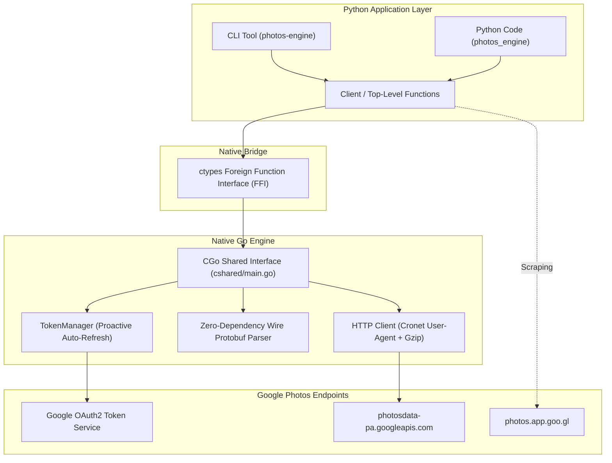

# Photos Engine Documentation

**Photos Engine** is a high-performance Google Photos mobile client library and CLI tool. It combines a compiled **native Go core engine** with **direct in-process Python C-ABI bindings (`ctypes`)**, following the packaging and performance design of [`httpcloak`](https://github.com/sardanioss/httpcloak).

---

## Key Highlights

- ⚡ **Zero-Overhead In-Process Execution**: The Go core compiles into a native C-shared library (`.dll` / `.so` / `.dylib`) loaded directly into Python memory via `ctypes`. No IPC, no subprocess spawn overhead, no local HTTP proxy latency.
- 🔗 **Instant Public Sharing**: Generates official `https://photos.app.goo.gl/...` public share links for single or batched media items using Google Photos' internal envelope endpoint.
- 📱 **Unlimited Pixel XL Backup Spoofing**: Implements Google Photos mobile device spoofing (Pixel XL hardware model & headers) to save and backup shared media without storage quota consumption.
- 📥 **Direct Stream Downloads**: Resolves direct original-quality download URLs, filenames, exact byte sizes, SHA-1 checksums, and deduplication keys.
- 🔍 **Fast Library Deduplication**: Pre-flight SHA-1 hash lookups against your Google Photos library to prevent duplicate uploads.
- 🗑️ **Permanent Deletion**: Two-step deletion protocol (Move-to-Trash followed by permanent erase) using raw deduplication keys.
- 🛠️ **Unified CLI & Python API**: Use either the command-line utility (`photos-engine`) or idiomatic Python code with type hints.

---

## Architecture Overview

---

## Navigation

- [Quickstart Guide](quickstart.md): Get up and running in under 3 minutes.
- [Python API Reference](api-reference.md): Detailed classes, methods, and types.
- [CLI Reference](cli-reference.md): Command-line tool commands and options.
- [Reverse Engineering Deep Dive](reverse-engineering.md): Google Photos mobile protobuf protocols, read masks, and device spoofing.
- [Architecture & C-ABI](architecture.md): How Go and Python communicate with zero overhead.
