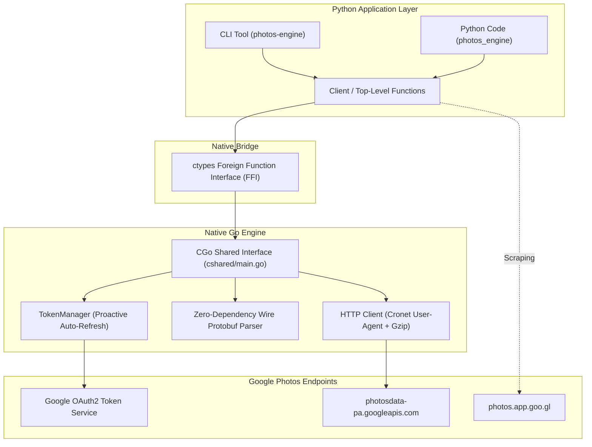

# Overview

**Photos Engine** is a high-performance Google Photos client library and CLI tool. It combines a compiled **native Go core engine** with **direct in-process Python C-ABI bindings (`ctypes`)**, styled after the packaging and execution model of [`httpcloak`](https://github.com/sardanioss/httpcloak).

!!! info "Zero-Overhead Hybrid Architecture"
    By compiling Go code directly into a platform-native dynamic shared library and bridging via C-ABI pointers, **Photos Engine** eliminates the IPC latency, memory overhead, and process-spawn penalties of subprocess CLIs or local HTTP daemon proxies.

---

## Key Highlights

-   ### Zero-Overhead Execution
    The Go core compiles into a native C-shared library (`.dll` / `.so` / `.dylib`), loaded directly into Python memory via `ctypes`. Zero IPC, zero subprocess overhead.

-   ### Public Share Links
    Generates official `https://photos.app.goo.gl/...` short share links for single or batched media items using Google Photos' internal envelope endpoint.

-   ### Unlimited Pixel XL Spoofing
    Simulates Google Pixel XL hardware identifiers and headers to save and import shared media with unlimited original quality backup status.

-   ### Direct Stream Downloads
    Resolves direct original-quality download stream URLs, original filenames, exact byte sizes, and SHA-1 checksums.

-   ### Fast Library Deduplication
    Pre-flight SHA-1 hash lookups against your Google Photos library to prevent duplicate uploads before spending network bandwidth.

-   ### Permanent Deletion
    Two-step expunge sequence (Move-to-Trash followed by permanent erase) using raw URL-safe deduplication keys.

---

## Architecture Diagram

---

## Performance Comparison

| Approach | Latency / Call | Process Memory | Binary Size | Port Binding |
| :--- | :--- | :--- | :--- | :--- |
| **Subprocess CLI (`.exe`)** | ~120 ms | High (forks new process) | ~15 MB per tool | None |
| **Local Proxy Server** | ~20–40 ms | High (background daemon) | ~30 MB | Required |
| **`photos-engine` (C-ABI)** | **< 0.5 ms** | **Low (shared process)** | **Single `.dll`** | **None** |
